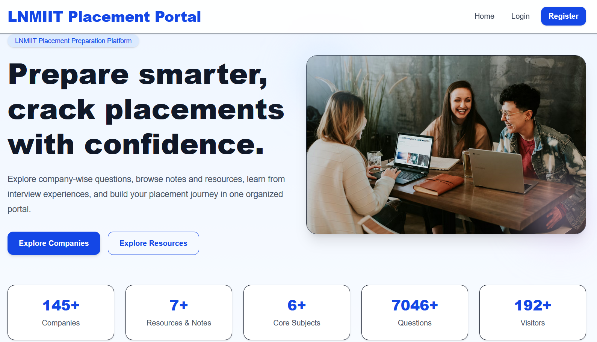
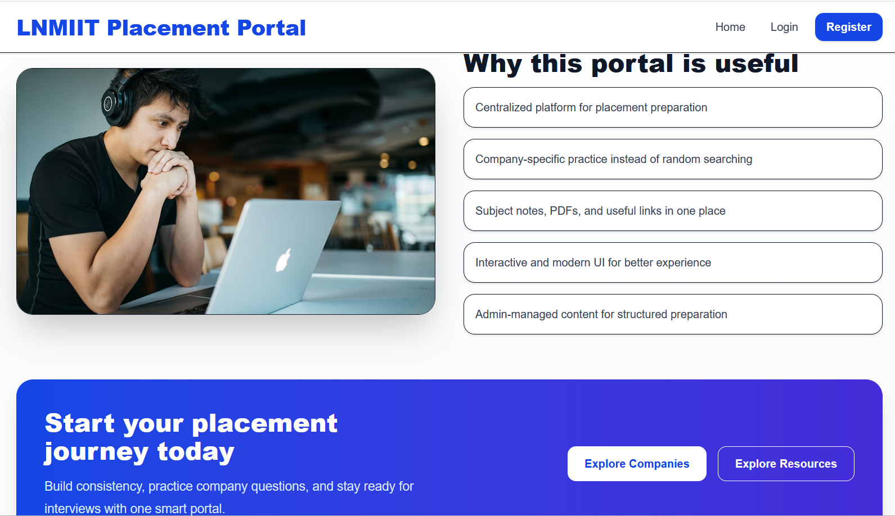
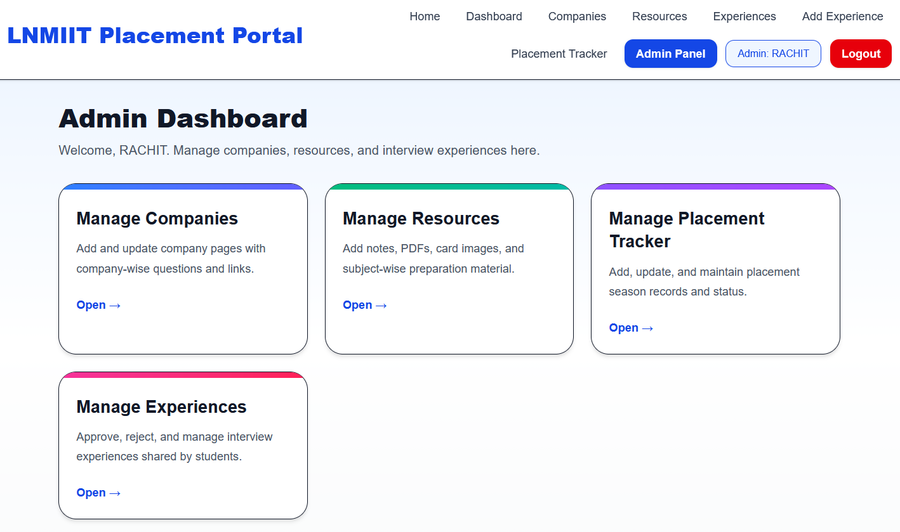
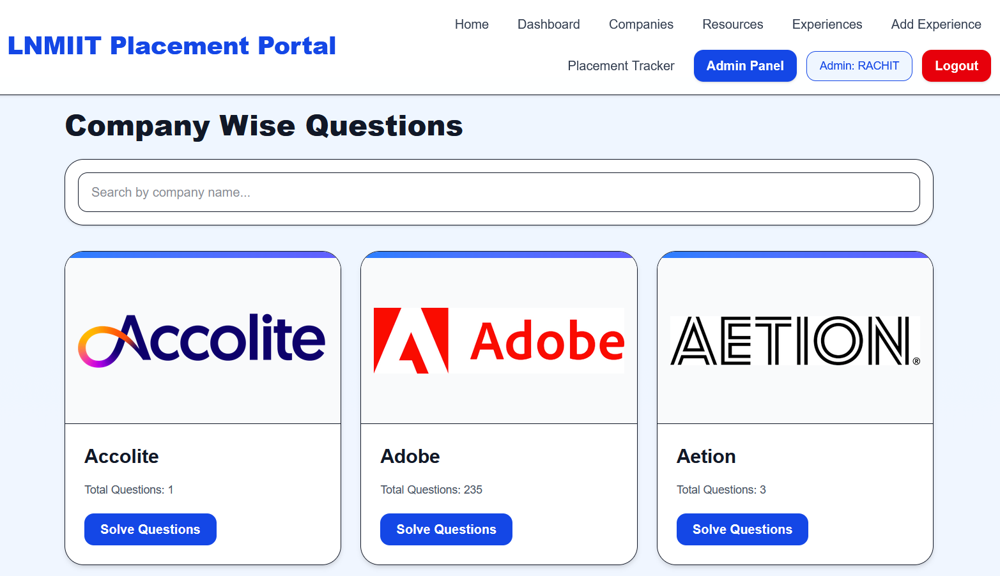
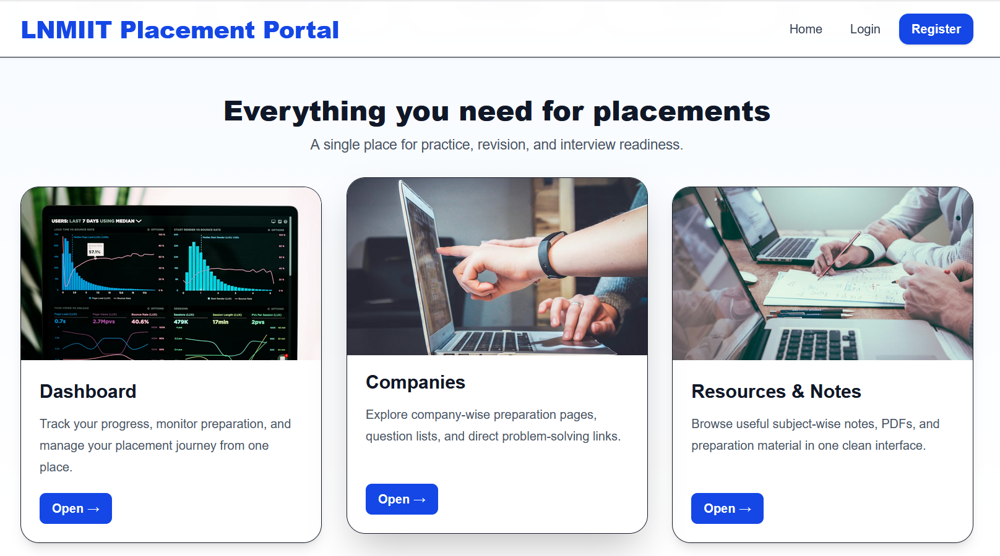
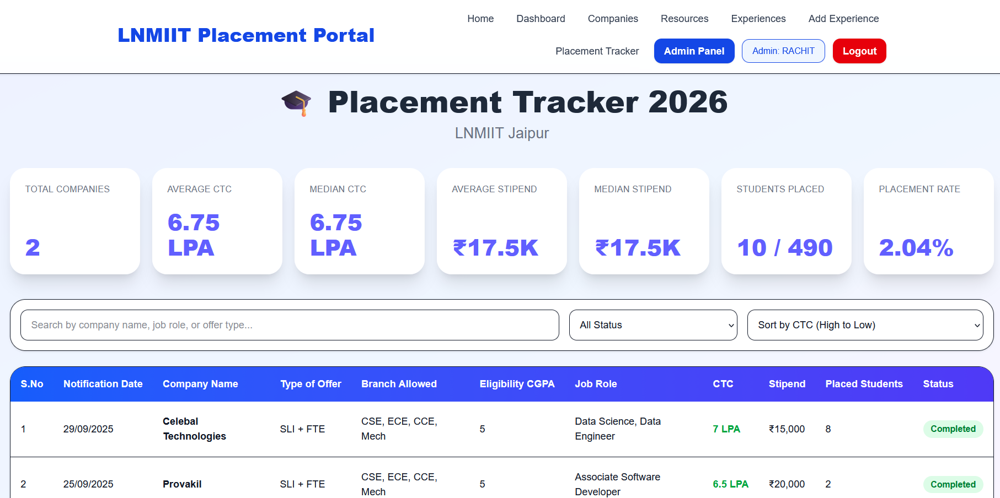

# 🚀 LNMIIT Placement Portal

<p align="center">

A full-stack placement preparation platform designed to help students prepare smarter and track placement progress in one centralized portal.

</p>

<p align="center">

💻 Built for LNMIIT students to streamline placement preparation with company resources, interview experiences, curated notes, and a smart placement tracker.

</p>

---

# 🌐 Live Demo

Frontend  
https://lnmiit-placement-portal.vercel.app

Backend API  
https://lnmiit-placement-portal-uzh1.onrender.com

---

# 📸 Screenshots

## 🏠 Home Page

<p align="center">

</p>

---
## 🏠 Features Page

<p align="center">

</p>

---

## 📊 Dashboard

<p align="center">

</p>

---

## 🏢 Companies Page

<p align="center">

</p>

---

## 📚 Resources Page

<p align="center">

</p>

---

## 💼 Placement Tracker

<p align="center">

</p>

---

# ✨ Features

### 🎯 Placement Preparation Platform
Centralized platform for placement preparation instead of scattered resources.

### 🏢 Company-wise Preparation
Access company specific questions and preparation material.

### 📚 Resources & Notes
Browse curated notes, PDFs, and preparation resources.

### 💬 Interview Experiences
Students can share real interview experiences to help juniors.

### ➕ Add Experience
Users can contribute their placement experience.

### 📊 Placement Tracker
Track company placement details including CTC, stipend and status.

### 🔐 Authentication System
Secure login and registration using JWT authentication.

### 🧑‍💼 Admin Panel
Admin can manage resources, companies and student experiences.

---

# 🛠 Tech Stack

## Frontend

<p>


</p>

- React.js
- Tailwind CSS
- Axios
- React Router
- Vite

---

## Backend

<p>


</p>

- Node.js
- Express.js
- MongoDB Atlas
- JWT Authentication
- Mongoose

---

## Deployment

<p>


</p>

- Frontend → Vercel
- Backend → Render
- Database → MongoDB Atlas
- Version Control → GitHub

---


# 📂 Project Structure

```
LNMIIT-Placement-Portal
│
├── backend
│   ├── config
│   ├── controllers
│   ├── middleware
│   ├── models
│   ├── routes
│   └── server.js
│
├── frontend
│   ├── src
│   ├── components
│   ├── pages
│   └── api
│
├── screenshots
│
└── README.md
```

---

# ⚙️ Installation & Setup

## 1️⃣ Clone Repository

```bash
git clone https://github.com/RACHIT7409/lnmiit-placement-portal.git
```

---

## 2️⃣ Backend Setup

```bash
cd backend
npm install
```

### Create `.env` file

```env
PORT=5000
MONGO_URI=your_mongodb_connection
JWT_SECRET=your_secret
```

### Run Backend

```bash
npm run server
```

---

## 3️⃣ Frontend Setup

```bash
cd frontend
npm install
```

### Create `.env`

```env
VITE_API_URL=http://localhost:5000/api
```

### Run Frontend

```bash
npm run dev
```

---

# 🔐 Authentication Flow

1️⃣ User registers or logs in  
2️⃣ Backend generates JWT token  
3️⃣ Token stored in `localStorage`  
4️⃣ Protected routes require authentication  
5️⃣ Admin role unlocks **Admin Panel**

---

# 📊 Database Schema

## User

```
name
email
password
role
createdAt
```

## Company

```
name
role
questions
resources
```

## Experience

```
company
rounds
questions
tips
status
```

---

# 🚀 Future Improvements

- Resume Analyzer  
- AI Interview Preparation  
- Coding Practice Integration  
- Real-time Placement Statistics  
- Notifications for new companies  

---

# 🤝 Contributing

Contributions are welcome.

1. Fork the repository  
2. Create a new branch

```bash
git checkout -b feature-name
```

3. Commit your changes

```bash
git commit -m "Added new feature"
```

4. Push to branch

```bash
git push origin feature-name
```

5. Open a Pull Request

---

# 📜 License
 
This project is licensed under the **MIT License**.
---

# 👨‍💻 Author

**RACHIT CHAWLA**

GitHub  
https://github.com/RACHIT7409

---

# ⭐ Support

If you like this project, please give it a ⭐ on GitHub.

It helps others discover the project.
